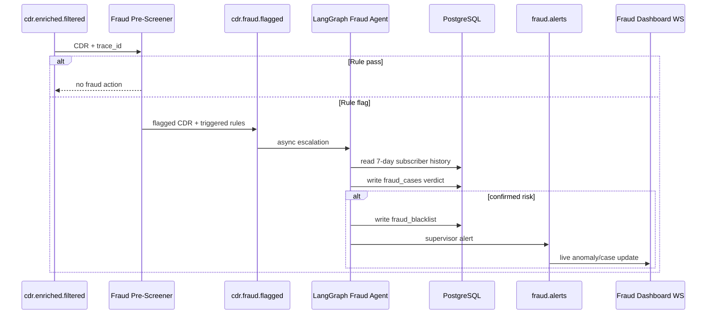
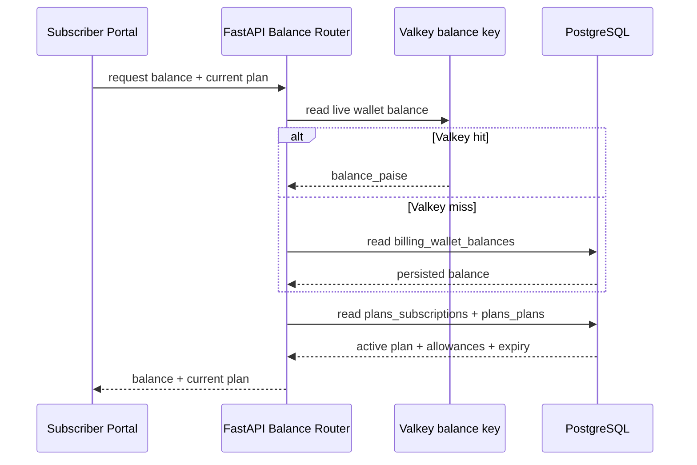
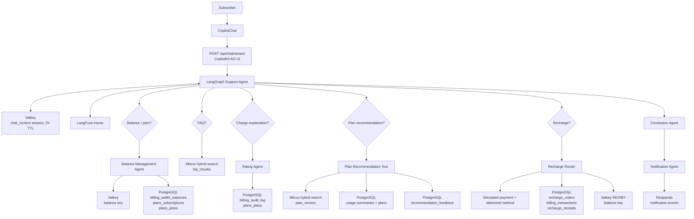
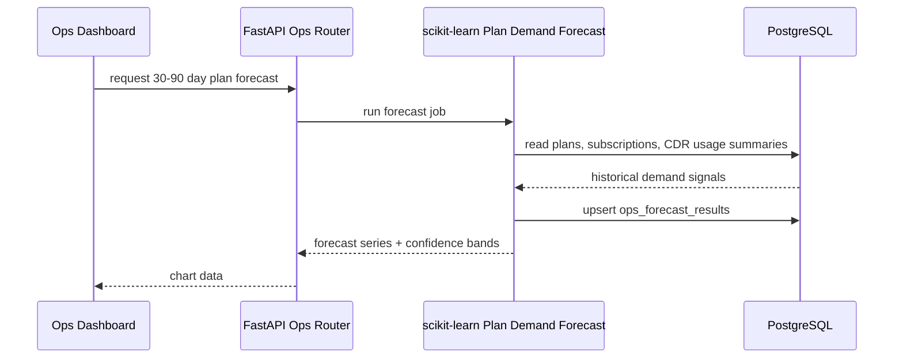
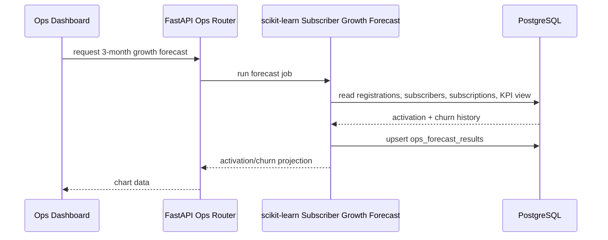

# CDR Pipeline

## CDR data input flow
```
CDR Source (Simulator or upstream)
  │
  ▼
Redpanda: cdr.raw  [24 partitions, key = subscriber_id]
  │
  ▼
Python Consumer Pool  [aiokafka, group_id='cdr-balance-updater']
  │  batch=500 | commit offset AFTER batch success
  │
  ├─► Dedup ──► Valkey SET (cdr_id, TTL=24h)
  │
  ├─► Balance Update ──► Valkey INCRBY pipeline (atomic)
  │                         └─► Async flush → PostgreSQL (bulk upsert, 2s or 5K)
  │
  └─► Filter & Publish ──► Redpanda: cdr.enriched.filtered
                              ├─► Fraud Pre-Screener (Kafka consumer, same Python codebase)
                              └─► Notification Trigger (Kafka consumer, same Python codebase)
```

## Fraud screener


# Subscriber Portal

## Balance/Current Plan Lookup


## Chatbot


# Ops Portal

## Data plan forecasting


## Subscriber growth forecasting

